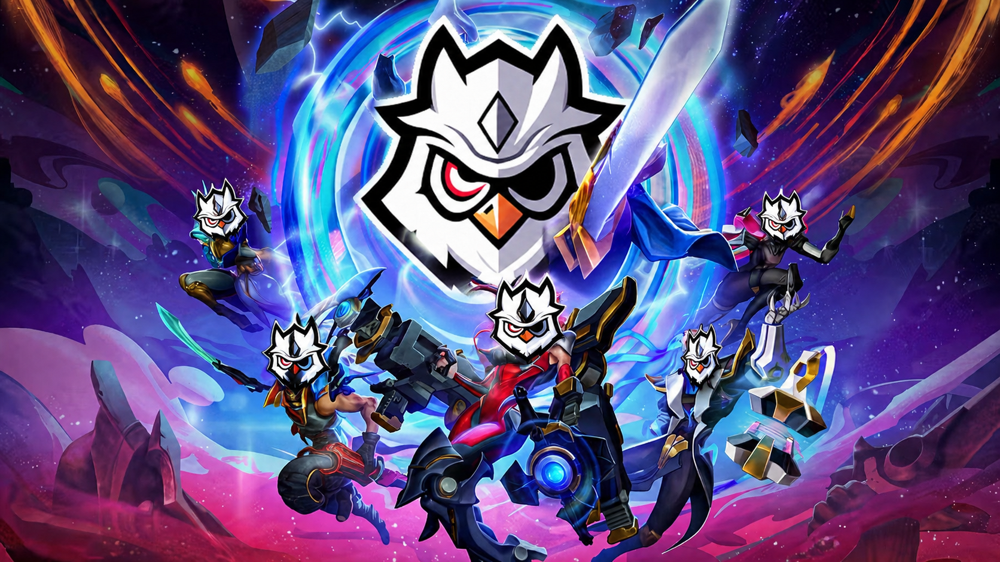

# OS FIGHT TACTICS

Teamfight Tactics on your Mac. Full screen, keyboard controls, no jank.

I got tired of squinting at TFT on my phone while my Apple Silicon Mac sat there
doing nothing. Streaming it felt laggy, and the usual emulators are a mess of
Android Studio installs and system tweaks. So I built the launcher I actually
wanted to use.

It runs a real Android device locally (Apple's own Hypervisor, nothing hacky),
renders straight to the GPU, and hands you keyboard controls that feel right for
TFT. You sign into *your* Google account and install the game from the real Play
Store — same as you would on a phone.

## Download

**[⬇︎ Download the latest .dmg](../../releases/latest)**

Then:

1. Open the `.dmg` and drag **OSFT - Launcher** into your Applications folder.
2. First launch: **right-click the app → Open** (macOS is cautious with apps it
   hasn't seen before — this only happens once).
3. Open the app, hit **Install game engine** once (~3.5 GB), then sign into the
   Play Store and grab Teamfight Tactics.

That's it. After the first setup it boots from a snapshot in a few seconds.

## What you need

- Apple Silicon Mac (M1 or newer)
- macOS 12 or later
- ~10 GB free for the setup, plus room for the game
- 8 GB RAM works, 16 GB is comfier

## Good to know

- Playing needs an active subscription — **$2/month, cancel whenever**. Grab a
  key at **[macosfighttactics.com](https://macosfighttactics.com)** and paste it
  into the app.
- It never ships or pushes games. You install them yourself, from your own Play
  Store account, exactly like on a real phone.
- No SIP disabling, no admin rights, no Android Studio, no Java. Your Mac stays
  the way it is.

## Something broke?

Open an [issue](../../issues) — tell me your Mac model, macOS version, and what
you were doing. I read them.

---

Made by one person who plays too much TFT.
